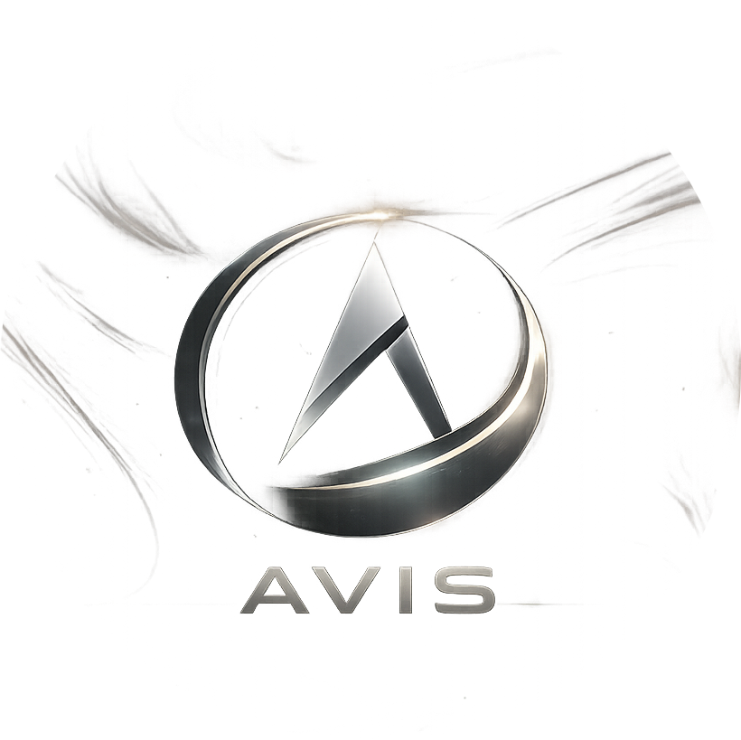
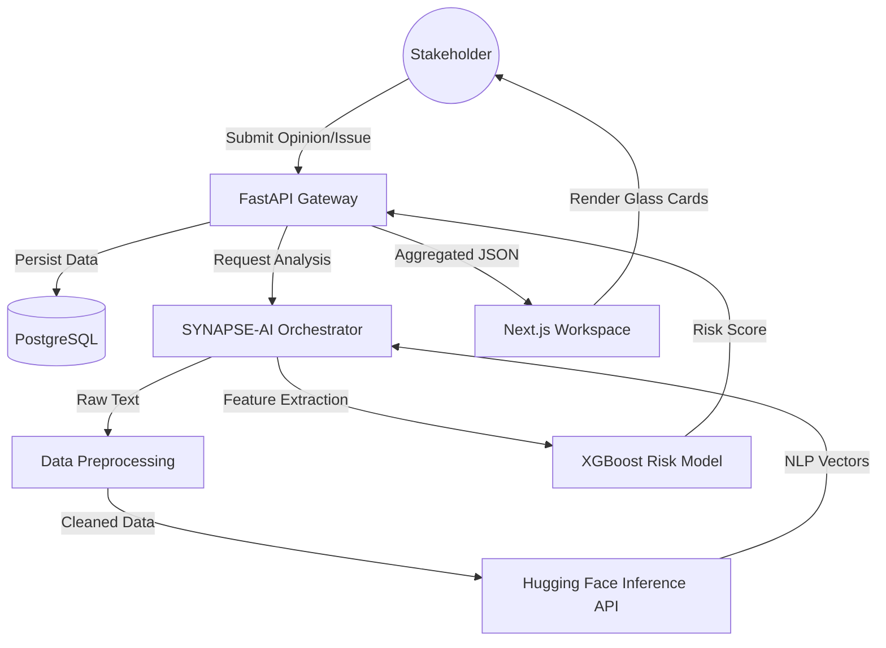

# <p align="center">  <br> AVIS – AI‑Driven Stakeholder Insight Platform </p>

<p align="center">
  
  
  
</p>

---

## 🌌 Overview

**AVIS** (AI‑Driven Stakeholder Insight Platform) is a high‑performance intelligence workspace designed to orchestrate complex stakeholder feedback analysis. Powered by the **SYNAPSE‑AI** engine, AVIS transforms raw qualitative data into actionable intelligence through a sophisticated 3D immersive interface.

> "Translating stakeholder voices into mathematical precision."

---

## ✨ Key Features

### 🧠 SYNAPSE‑AI Intelligence
*   **Executive Summarization**: Automated distillation of multi‑stakeholder perspectives into concise italicized summaries.
*   **Sentiment Intelligence**: Granular emotional distribution analysis using advanced NLP models.
*   **Topic Discovery**: Unsupervised theme extraction to identify hidden patterns in feedback.
*   **XGBoost Churn Risk**: Predictive modeling to identify disengagement risks before they manifest.

### 🛡️ Secure Pipeline Management
*   **Privacy Control**: Toggle between **Public** and **Private** concerns with one click.
*   **Deep Linking**: Direct shareable links for private issues, ensuring controlled access to sensitive discussions.
*   **Lifecycle Management**: Seamless transition between *Open*, *Resolved*, and *Reopened* states.

### 💎 Immersive UI/UX
*   **Glassmorphism Architecture**: A premium dark‑mode interface featuring obsidian blurs and high‑refraction cards.
*   **3D Marble Scene**: Real‑time Interactive Three.js background providing a dynamic spatial context for intelligence work.
*   **Responsive Flow**: Optimized for high‑density data visualization across all viewport dimensions.

---

## 📊 System Architecture

### 🔄 Data Flow Diagram (DFD)



### ⚡ User Activity Diagram

```mermaid
activityDiagram
    start
    :Access Workspace;
    if (Is Logged In?) then (yes)
      :View All Issues;
      split
        :Select Issue;
        :Submit Opinion;
        if (Opinions >= 3?) then (yes)
          :Trigger SYNAPSE-AI;
          :Generate Intelligence;
        else (no)
          :Wait for Consensus;
        endif
      split again
        :Raise New Issue;
        :Set Privacy Level;
        if (Is Private?) then (yes)
          :Generate Direct Link;
          :Share with Stakeholders;
        else (no)
          :Publish to All Issues;
        endif
      end split
    else (no)
      :Redirect to Clerk Auth;
    endif
    stop
```

---

## 🛠️ Technical Stack

### **Frontend Infrastructure**
- **Next.js 16 (App Router)**: Utilizing Turbopack for lightning‑fast HMR.
- **Three.js (React Three Fiber)**: Powering the high‑fidelity immersive backgrounds.
- **Tailwind CSS 4**: Implementing advanced backdrop filters and obsidian glass effects.
- **Zustand**: Lightweight, atomic state management for seamless sync across components.

### **Backend Infrastructure**
- **FastAPI (Python 3.12)**: Asynchronous, high‑performance service layer.
- **SQLAlchemy (Neon/PostgreSQL)**: Robust ORM for concern persistence and opinion cascading.
- **Hugging Face Inference**: Leveraging transformer models for sentiment and topic extraction.
- **XGBoost**: Proprietary risk scoring implementation.

---

## 🚀 Getting Started

### Prerequisites
- Node.js 18+
- Python 3.12+
- Neon PostgreSQL Instance
- Clerk Auth Keys

### Installation

1. **Clone the Secure Vault**
   ```bash
   git clone https://github.com/kodo-kaze/avis.git
   cd avis
   ```

2. **Frontend Deployment**
   ```bash
   npm install
   npm run dev
   ```

3. **Backend Service Layer**
   ```bash
   cd backend
   python -m venv venv
   source venv/bin/activate
   pip install -r requirements.txt
   uvicorn app.main:app --reload
   ```

---

## 📡 System Status
**AVIS ENGINE V1.0** | **SYNAPSE-AI-NODE-01** | **SIGNATURE AUTHENTICATED**

<p align="right">(c) 2026 AVIS Intelligence Systems</p>
